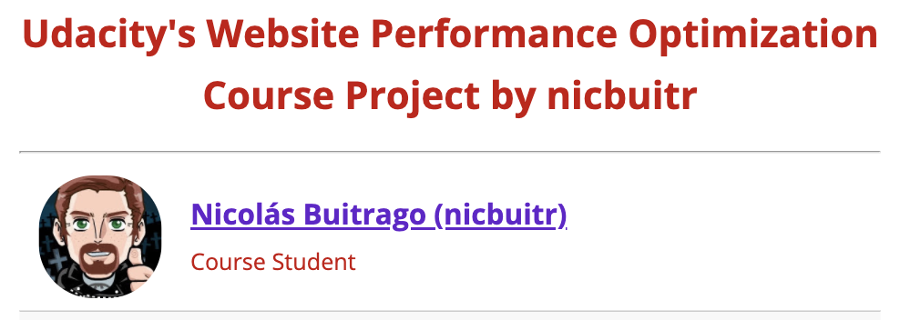

<p align="center">
  <a href="../../"></a>
</p>

## Information:

This repo is the final project of [Udacity's Critical Rendering Path course](https://www.udacity.com/course/ud884).
It is originally cloned from [Website Performance Optimization portfolio project](https://github.com/udacity/frontend-nanodegree-mobile-portfolio)
The purpose was to optimize this online portfolio for speed. In particular, optimize the critical rendering path and make this page render as quickly as possible by applying the techniques learned from the course.

It is built with HTML, CSS, JavaScript and also used the Chrome DevTools to optimize the performance.

### Final Project Rubric:

This is the scoring chart defined by the instructors provided at [Lesson 4: Final Project - 2. Rubric](https://classroom.udacity.com/courses/ud884/lessons/3056248797/concepts/30802886010923).

Also I posted my reply at the course's [Optimized Portfolios Discussion](https://discussions.udacity.com/t/optimized-portfolios/16161/488?u=nicbuitr) as requested at [Lesson 3: Optimizing the CRP - 23. Quiz: The Final Project Submission](https://classroom.udacity.com/courses/ud884/lessons/1469569174/concepts/15669686092589030923).

<p align="center">
  <a href="https://i.imgur.com/OWS8JEE.png" target="_blank" rel="noopener"></a>
</p>

## Changes (DD/MM/AAAA)

- 31/07/2020 Initial Upload.
- 05/08/2020 index.html optimizations and README.md updates.
- 13/08/2020 pizza.html optimizations and README.md updates.
- 14/08/2020 further pizza.html optimizations and README.md updates.
- 14/08/2020 minified the CSS and JavaScript files.
- 15/08/2020 fixed a bug at mobile devices and uploaded before/after audit images.
- 15/08/2020 added the final project's rubric image.
- 15/08/2020 added before/after collage images.

## How To View:

Just click here: [WebPerfOptimization](https://nicbuitr.github.io/WebPerfOptimization/).

You can compare the lighthouse audit results to the original version of the course which is this one:
- [cameronwp.github.io - udportfolio](http://cameronwp.github.io/udportfolio/).

## How To Download:

Just download or clone the repo:

    $ git clone https://github.com/nicbuitr/WebPerfOptimization.git

## Installation

Requirements:

- [Python](https://www.python.org/downloads/) in order to set up local server.	

Once Python is installed, just run:

    $ python -m SimpleHTTPServer 8080

Once it's deployed go to http://localhost:8080/

## Optimization results

### index.html improvements

- Completed the metadata
- Added the async attribute for non-critical resources
  - favicon.ico
  - perfmatters.js
- Added the attribute media="print" to print.css
- Downloaded and added the fonts into the style.css
- Added the attribute font-display: swap; to the fonts to avoid FOIT and ensure that the text remains visible during webfont load
- Removed the Google Analytics script as it is not being used
- Removed a couple of CSS styles that were not being used
- Added h1 header for better HTML semantics
- Added picture tag elements to use the right image sizes according to the viewport
- Added alt descriptions to all the images
- Resized and compressed pizzeria.jpg
- Moved the locally stored images to cloud storage to be able to request different sizes as parameter
- Added discernible names to all the anchor links
- Made sure that all links used https to avoid mixed content
- Made sure that all the images were displayed with appropriate sizes on all viewports
- Made sure that no errors were logged on the console
- Did not minify nor compress the JavaScript and CSS files as the gaining was negligible

#### Desktop - Before/After

 | 
:---:|:---:	

 | 	
:---:|:---:	

#### Mobile - Before/After

 | 
:---:|:---:	

 | 	
:---:|:---:

### pizza.html improvements

- Refactored the page to be responsive
- JavaScript optimizations:
  - Removed redundant calculations from the for at changePizzaSizes function and only left the size update inside of it
  - As all the pizzas have the same size, calculated the new size using the first pizza element and just updated it to all the others instead of calculating the same thing for every pizza which also reduced the interactions with the DOM by using less query selections 
  - At both the moving and random pizzas used Document Fragment to prevent layout thrashing by appending an element with all the pizzas to the DOM at once to have just one paint, instead of one time for every pizza
  - At the updatePositions function, moved the scrollTop outside of the for as it only needs to be obtained once, this also prevents layout thrashing as it is a function that triggers layout
  - To avoid excessive DOM size, the amount of moving pizzas painted is no longer a fixed amount of 200, but instead dynamically calculated according to the viewport size e.g: 7 horizontal x 5 vertical = 42 total on a screen of 1440x1147
  - Deleted the determineDx function, the pizza size is a percentage that dynamically adjusts to the screen size for more efficiency and gets updated once by the sizeSwitcher function, thus, width calculation based upon old and current window width is no longer required
  - Moving Pizzas position is now set upon creation of each, this eliminates the double iteration by no longer needing to call the updatePositions function sequentially after they are created to run over all of them twice
  - Implemented `Intersection Observer`to load up to 102 Random Pizzas upon scroll and avoid excessive DOM size
  - The newly added Random Pizzas are properly sized according to the current Scroll Size selection
  - Added opacity transition animation for a better user experience
- Optimized and reduced the size to pizzeria.jpg
- The pizza.png size now changes proportionally to ensure that it keeps the correct aspect ratio
- Moved and centralized all the static styles at "style.css" stylesheet to prevent unnecessary layout triggers by adding them with JavaScript, also for better practices of using stylesheet for styles and JavaScript only for dynamic styles
- Merged all the bootstrap-grid.css styles that were being used onto "styles.css" to centralize the styles and remove the unused ones
- Added a label to the Pizza Size slider
- Changed the font color to white for better contrast and accessibility
- Restructured the HTML tags for better SEO making use of proper HTML Semantics
- Added the `<meta name="viewport">` tag to make the page responsive
- Added the async attribute to bootstrap-grid.css to avoid it causing render blocking
- Added `<h1>` header for better HTML semantics
- Added picture tag elements to use the right image sizes according to the viewport
- Added the alt attributes with their descriptions to all the images
- For the "Paisano's Pizzeria" image added a padding to its parent and set the image position as absolute to save the space for when the image is loaded to prevent layout shifting, also preloaded the images
- Increased the buttons size for better usability on touch devices for better SEO
- Minified the JavaScript and CSS files for maximum gains

#### Desktop - Before/After

 | 
:---:|:---:	

 | 	
:---:|:---:	


#### Mobile - Before/After

 | 
:---:|:---:	

 | 	
:---:|:---:

## Built with:

[](https://www.w3.org/html/) | [](https://www.w3.org/Style/CSS/)  | [](https://developer.mozilla.org/en-US/docs/Web/JavaScript) | [](https://code.visualstudio.com/)
:---:|:---:|:---:|:---:


## License

MIT © [Nicolás Buitrago Castaño](https://github.com/nicbuitr)

## Original Repo's README with further instructions to setup remote server with NGROK

### Website Performance Optimization portfolio project

Your challenge, if you wish to accept it (and we sure hope you will), is to optimize this online portfolio for speed! In particular, optimize the critical rendering path and make this page render as quickly as possible by applying the techniques you've picked up in the [Critical Rendering Path course](https://www.udacity.com/course/ud884).

To get started, check out the repository and inspect the code.

### Getting started

#### Part 1: Optimize PageSpeed Insights score for index.html

Some useful tips to help you get started:

1. Check out the repository
1. To inspect the site on your phone, you can run a local server

  ```bash
  $> cd /path/to/your-project-folder
  $> python -m SimpleHTTPServer 8080
  ```

1. Open a browser and visit localhost:8080
1. Download and install [ngrok](https://ngrok.com/) to the top-level of your project directory to make your local server accessible remotely.

  ``` bash
  $> cd /path/to/your-project-folder
  $> ./ngrok http 8080
  ```

1. Copy the public URL ngrok gives you and try running it through PageSpeed Insights! Optional: [More on integrating ngrok, Grunt and PageSpeed.](http://www.jamescryer.com/2014/06/12/grunt-pagespeed-and-ngrok-locally-testing/)

Profile, optimize, measure... and then lather, rinse, and repeat. Good luck!

#### Part 2: Optimize Frames per Second in pizza.html

To optimize views/pizza.html, you will need to modify views/js/main.js until your frames per second rate is 60 fps or higher. You will find instructive comments in main.js. 

You might find the FPS Counter/HUD Display useful in Chrome developer tools described here: [Chrome Dev Tools tips-and-tricks](https://developer.chrome.com/devtools/docs/tips-and-tricks).

### Optimization Tips and Tricks
* [Optimizing Performance](https://developers.google.com/web/fundamentals/performance/ "web performance")
* [Analyzing the Critical Rendering Path](https://developers.google.com/web/fundamentals/performance/critical-rendering-path/analyzing-crp.html "analyzing crp")
* [Optimizing the Critical Rendering Path](https://developers.google.com/web/fundamentals/performance/critical-rendering-path/optimizing-critical-rendering-path.html "optimize the crp!")
* [Avoiding Rendering Blocking CSS](https://developers.google.com/web/fundamentals/performance/critical-rendering-path/render-blocking-css.html "render blocking css")
* [Optimizing JavaScript](https://developers.google.com/web/fundamentals/performance/critical-rendering-path/adding-interactivity-with-javascript.html "javascript")
* [Measuring with Navigation Timing](https://developers.google.com/web/fundamentals/performance/critical-rendering-path/measure-crp.html "nav timing api"). We didn't cover the Navigation Timing API in the first two lessons but it's an incredibly useful tool for automated page profiling. I highly recommend reading.
* <a href="https://developers.google.com/web/fundamentals/performance/optimizing-content-efficiency/eliminate-downloads.html">The fewer the downloads, the better</a>
* <a href="https://developers.google.com/web/fundamentals/performance/optimizing-content-efficiency/optimize-encoding-and-transfer.html">Reduce the size of text</a>
* <a href="https://developers.google.com/web/fundamentals/performance/optimizing-content-efficiency/image-optimization.html">Optimize images</a>
* <a href="https://developers.google.com/web/fundamentals/performance/optimizing-content-efficiency/http-caching.html">HTTP caching</a>

### Customization with Bootstrap
The portfolio was built on Twitter's <a href="http://getbootstrap.com/">Bootstrap</a> framework. All custom styles are in `dist/css/portfolio.css` in the portfolio repo.

* <a href="http://getbootstrap.com/css/">Bootstrap's CSS Classes</a>
* <a href="http://getbootstrap.com/components/">Bootstrap's Components</a>
